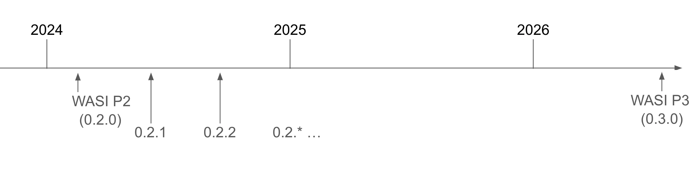

This roadmap is a living document representing projected timelines for WASI releases. Goals and projections are provisional and subject to revision.

## WASI Releases

WASI point releases occur every two months, on the first Thursday of that month, on a **release train model**: a regular cadence in which releases are published regardless of the enhancements and fixes that are "ready for the train." Point releases include smaller features and bug fixes, while major features and breaking changes are generally reserved for major versions.

## WASI P3

WASI 0.3.0 is currently in **release candidate** stage (`0.3.0-rc-2026-03-15`). WASI P3 support is available in [Wasmtime 43+](https://github.com/bytecodealliance/wasmtime) and [jco](https://github.com/bytecodealliance/jco).

WASI P3 adds **native async support** to the Component Model and refactors WASI P2 interfaces to take advantage of native async primitives: `async func`, `stream<T>`, and `future<T>`. The `wasi:io` package is removed entirely, with its functionality absorbed into the Component Model's Canonical ABI. For a full overview of changes, see [WASI P3](releases/wasi-p3.md).

Implementations may continue to support WASI P2 alongside P3, either by implementing both versions or by virtualizing (polyfilling) P2 in terms of P3.

After WASI 0.3.0 is released, a series of incremental and backwards-compatible 0.3.x releases will occur on the release train model. These point releases are expected to include: 

* **Cancellation** automatically integrated with language idioms
* **Specialization** of `tuple<stream<u8>, future<result<trailers, http-error>>>` existing in 0.3.0
* **Stream optimization** with Canonical ABI built-ins for forwarding/splicing, skipping/writing-zeroes, stream data segment, and lulls
* **Caller-supplied buffers** with more zero-copy in more scenarios
* **Threads**: first cooperative, then preemptive

You can find more information in the [WebAssembly CG presentation from February 2025](https://docs.google.com/presentation/d/1z0WXS5BLFtbVynM9xAyilecYskN1IKe9Dad1nDEmgU8/edit#slide=id.g33067d21cc1_0_5).

## Project timeline

The provisional timeline for WASI releases is as follows:

