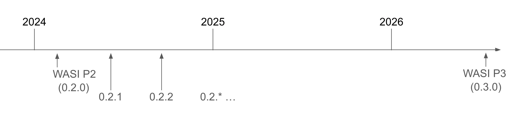

This roadmap is a living document representing projected timelines for WASI releases. Goals and projections are provisional and subject to revision.

## WASI releases

WASI patch releases follow a **release train model**: a regular cadence in which releases are published regardless of the enhancements and fixes that are "ready for the train." Patch releases include smaller features and bug fixes, while major features and breaking changes are generally reserved for major versions.

WASI 0.3 patch releases ship every two months, on the second Tuesday. WASI 0.2.1 through 0.2.12 followed the same two month cadence on the first Tuesday.

WASI 0.3.0 was an exception to the release train, shipping on June 11, 2026 following a WASI Subgroup vote. WASI 1.0 may also be scheduled outside the train. The cadence after 1.0 is undetermined.

### Release schedule

Releases through WASI 0.3.1 have shipped. Later dates are planned and subject to change.

| Release | Date |
| ------- | ---- |
| WASI 0.3.0 | June 11, 2026 (one-off release) |
| WASI 0.3.1 | August 11, 2026 |
| WASI 0.3.2 | October 13, 2026 |
| WASI 0.3.3 | December 8, 2026 |
| WASI 0.3.4 | February 9, 2027 |
| WASI 0.3.5 | April 13, 2027 |
| WASI 0.3.6 | June 8, 2027 |
| WASI 0.3.7 | August 10, 2027 |
| WASI 0.3.8 | October 12, 2027 |
| WASI 0.3.9 | December 14, 2027 |

Releases are cut by a WASI Subgroup co-chair through an automated GitHub Actions workflow. For the full process, see [Release](https://github.com/WebAssembly/WASI/blob/main/docs/Release.md) in the WASI repository.

## WASI 0.3

WASI 0.3.0 was released on June 11, 2026. WASI 0.3 support is available in [Wasmtime](https://wasmtime.dev/) 46 and later, which enables WASI 0.3 by default, and in [jco](https://github.com/bytecodealliance/jco).

WASI 0.3 adds **native async support** to the Component Model and refactors WASI 0.2 interfaces to take advantage of native async primitives: `async func`, `stream<T>`, and `future<T>`. The `wasi:io` package is removed entirely, with its functionality absorbed into the Component Model's Canonical ABI. For a full overview of changes, see [WASI 0.3](releases/wasi-p3.md).

Implementations may continue to support WASI 0.2 alongside 0.3, either by implementing both versions or by virtualizing (polyfilling) 0.2 in terms of 0.3.

Following WASI 0.3.0, a series of incremental and backwards-compatible 0.3.x releases will occur on the release train model. As projected in February 2025, these patch releases are expected to include:

* **Cancellation** automatically integrated with language idioms
* **Specialization** of `tuple<stream<u8>, future<result<trailers, http-error>>>` existing in 0.3.0
* **Stream optimization** with Canonical ABI built-ins for forwarding/splicing, skipping/writing-zeroes, stream data segment, and lulls
* **Caller-supplied buffers** with more zero-copy in more scenarios
* **Threads**: first cooperative, then preemptive

You can find more information in the [WebAssembly CG presentation from February 2025](https://docs.google.com/presentation/d/1z0WXS5BLFtbVynM9xAyilecYskN1IKe9Dad1nDEmgU8/edit#slide=id.g33067d21cc1_0_5).

## Project timeline

The provisional timeline for WASI releases is as follows:

