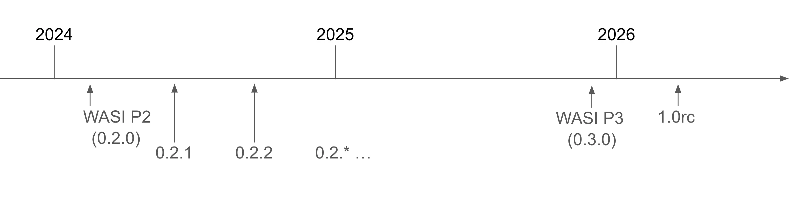

This roadmap is a living document representing projected timelines for WASI releases. Goals and projections are provisional and subject to revision.

## WASI Releases

WASI point releases occur every two months, on the first Thursday of that month, on a **release train model**&mdash;a regular cadence in which releases are published regardless of the enhancements and fixes that are "ready for the train." Point releases include smaller features and big fixes, while major features and breaking changes are generally reserved for major versions.

## Upcoming WASI 0.3 releases

At this time, WASI 0.3.0 previews are expected in August 2025 and completion is expected around November 2025. Please see the [presentation](https://github.com/WebAssembly/meetings/blob/main/wasi/2025/presentations/2025-05-01%20WASI%200.3.0%20Update%20May.pdf) and [notes](https://github.com/WebAssembly/meetings/blob/main/wasi/2025/WASI-05-01.md) from the May 2025 WASI SG meeting for more information. 

WASI 0.3.0 will add **native async support** to the Component Model and refactor WASI 0.2 interfaces to take advantage of native async. 

Native async will enable any component-level function to be implemented and/or called asynchronously, with asynchrony implemented at the level of the [Canonical ABI](https://component-model.bytecodealliance.org/advanced/canonical-abi.html). This includes explicit `stream<T>` and `future<T>` types for use anywhere in function parameters and results.

When WASI 0.3 is launched, implementations may continue to support 0.2, either by implementing 0.3 alongside it, or by virtualizing (polyfilling) 0.2 in terms of 0.3.

After WASI 0.3.0 is released, a series of incremental and backwards-compatible 0.3.x releases will occur on the release train model. These point releases are expected to include: 

* **Cancellation** automatically integrated with language idioms
* **Specialization** of `tuple<stream<u8>`, `future<result<trailers, http-error>>>` existing in 0.3.0
* **Stream optimization** with Canonical ABI built-ins for forwarding/splicing, skipping/writing-zeroes, stream data segment, and lulls
* **Caller-supplied buffers** with more zero-copy in more scenarios
* **Threads**: first cooperative, then preemptive

You can find more information in the [WebAssembly CG presentation from February 2025](https://docs.google.com/presentation/d/1z0WXS5BLFtbVynM9xAyilecYskN1IKe9Dad1nDEmgU8/edit#slide=id.g33067d21cc1_0_5).

## Project timeline

The provisional timeline for WASI releases is as follows:

